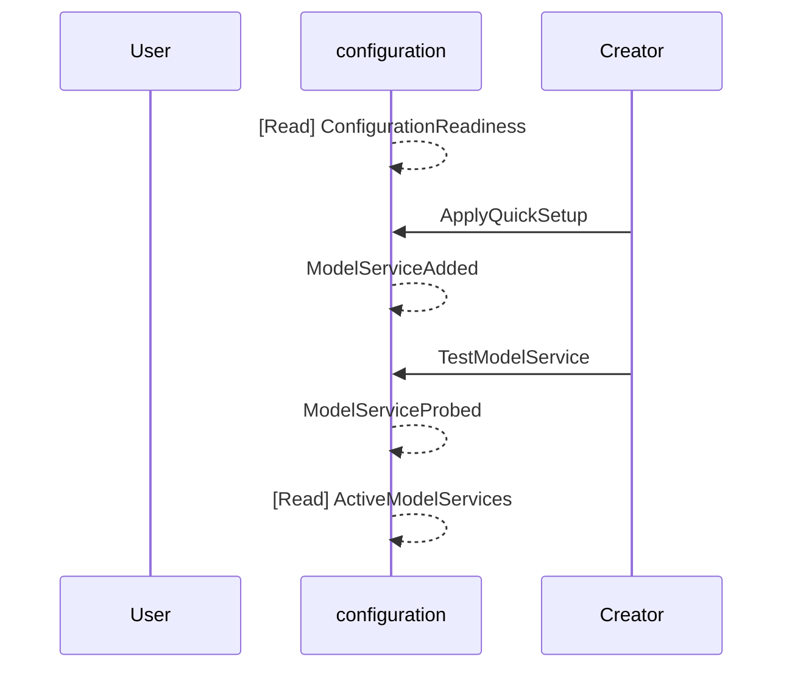
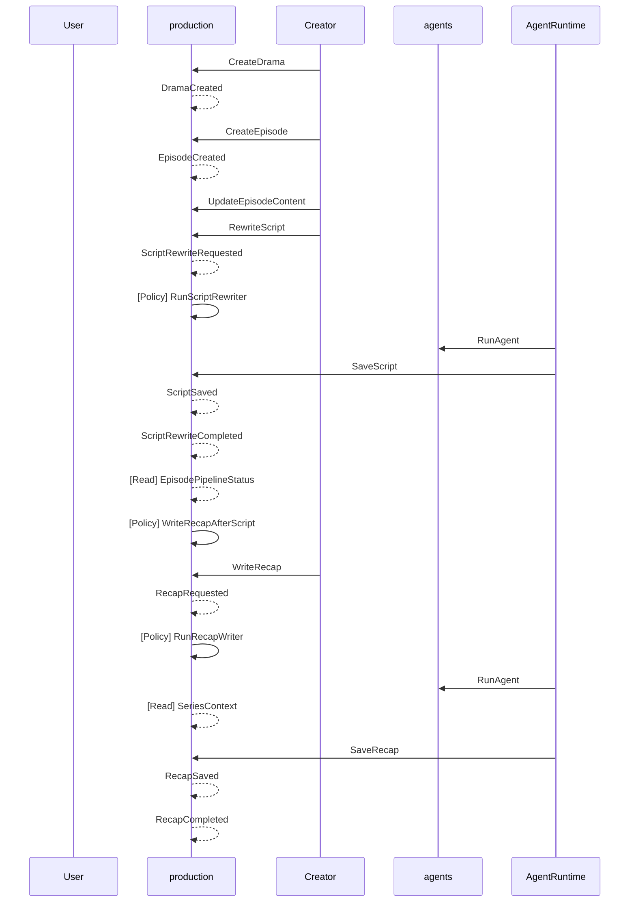
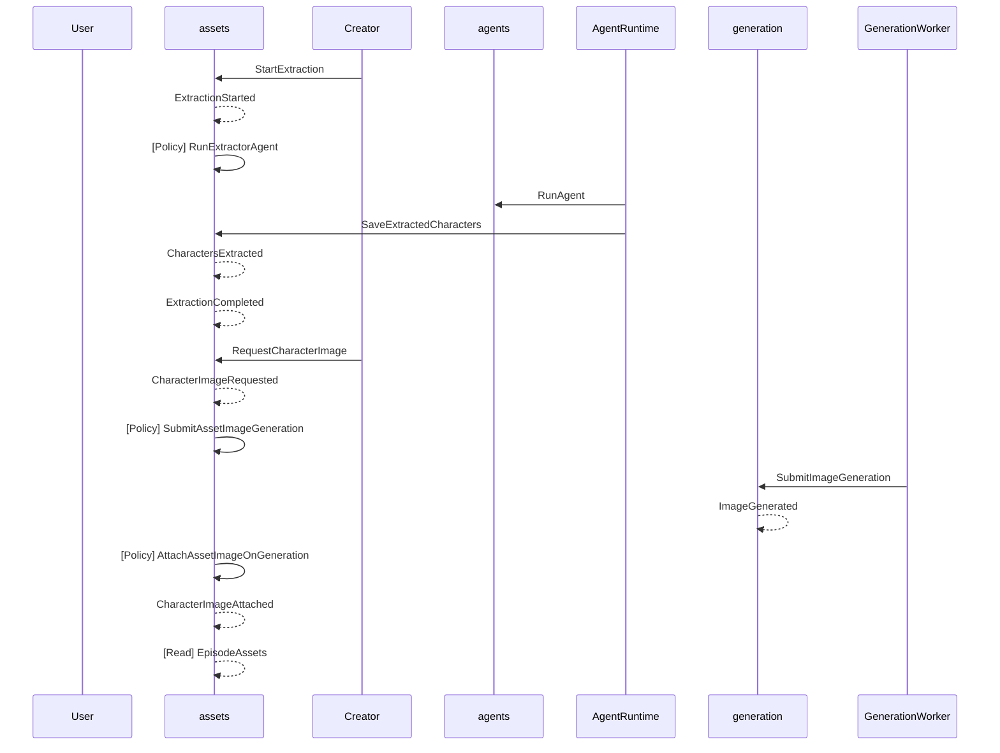
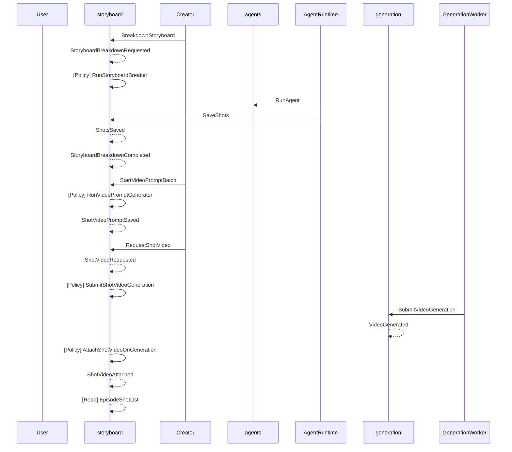
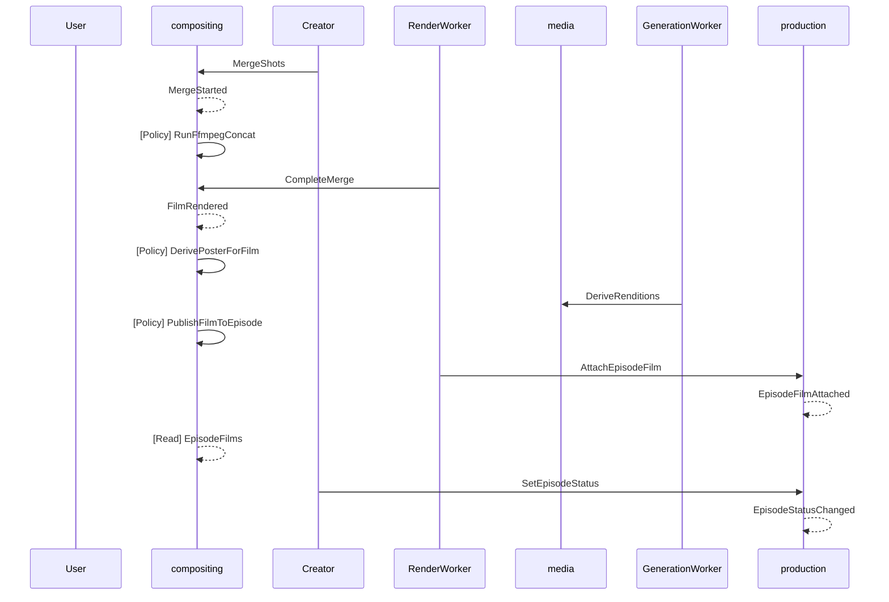
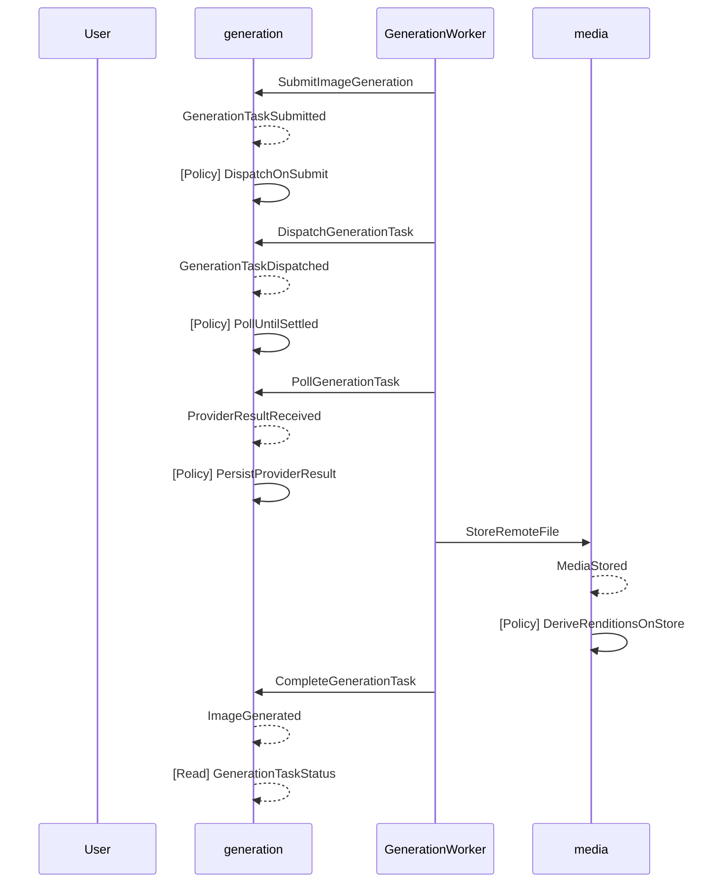
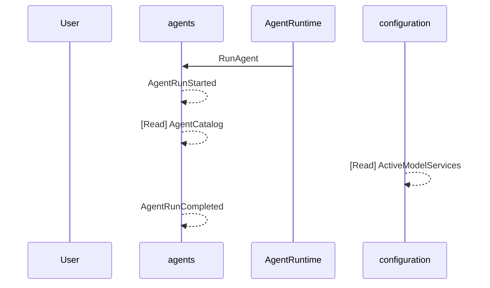

# Domain Knowledge Index

> Auto-generated — do not edit manually. Run `domain-knowledge-kit render` to regenerate.

## Bounded Contexts

| Context | Description |
|---------|-------------|
| [production](production/index.md) | Dramas (projects) and their episodes: the production lifecycle from raw source text to a finished episode film. |
| [assets](assets/index.md) | Characters, scenes and props extracted from a script, their final image prompts and reference images. |
| [storyboard](storyboard/index.md) | Storyboard breakdown of an episode into shots, per-shot video prompts, reference bindings and shot videos. |
| [generation](generation/index.md) | Provider-agnostic image and video generation tasks: submission, dispatch, polling and result persistence. |
| [compositing](compositing/index.md) | Merging shot videos into an episode film with FFmpeg and exporting it. |
| [media](media/index.md) | Local media storage: uploads, persisted generation results, thumbnails, poster frames and static serving. |
| [configuration](configuration/index.md) | Model service configuration (text/image/video providers), style presets and application settings. |
| [agents](agents/index.md) | The agent runtime: production agents, their editable prompts and skills, and agent runs against the domain. |

## Actors

| Actor | Type | Description |
|-------|------|-------------|
| Creator | human | The person producing a short drama. Creates projects and episodes, pastes source text, reviews AI output at every stage, and exports the finished film. |
| AgentRuntime | system | The in-process agent runtime inside the API. Runs the five production agents (script rewriter, extractor, storyboard breaker, prompt generator, recap writer) as tool-calling loops against a text model, and executes their tools as commands on the domain. |
| GenerationWorker | system | The background worker inside the API that drives image and video generation tasks — builds provider requests, submits them, polls for completion, persists results locally and writes them back to the owning asset or shot. |
| RenderWorker | system | The background worker that concatenates shot videos into an episode film by driving the bundled FFmpeg binaries. |
| Bootstrap | system | The API process at startup. Applies database migrations, seeds style presets, copies the agent workspace template once into the data directory and marks interrupted generation tasks as failed. |
| FFmpeg | system | The FFmpeg and FFprobe binaries bundled with the API (overridable by environment variables). Used for concatenation, duration probing and poster-frame extraction. |
| TextModelProvider | external | An OpenAI-compatible or Gemini chat-completion endpoint (official or relay) configured as a text model service. Powers every agent run. |
| ImageModelProvider | external | An image generation endpoint (OpenAI images, Gemini image, Volcengine and similar) behind an image provider adapter. Returns a URL or inline base64, synchronously or through an async task. |
| VideoModelProvider | external | A video generation endpoint (Seedance, MiniMax, Wan and similar) behind a video provider adapter. Accepts a prompt plus reference images, videos and audio, and returns a task id to poll. |

## Glossary Index

| Term | Context | Definition |
|------|---------|------------|
| Agent | [agents](agents/index.md) | A named tool-calling loop with a fixed tool set and instructions assembled per run from its prompt file, its skills and the content-language directive. |
| Agent run | [agents](agents/index.md) | One invocation of an agent scoped to a drama and episode, with an optional text model or service override, bounded by a maximum number of steps. |
| Beat | [storyboard](storyboard/index.md) | A story unit such as the setup, the inciting moment, the climax or a reversal. Two beats never share a shot, so a beat change is always a place where one shot ends and the next begins. |
| Breakdown | [storyboard](storyboard/index.md) | The storyboard-breaker agent run that replaces the episode's shots from the current script, saving in batches of at most 8 with idempotent upsert by shot number. |
| Content language | [configuration](configuration/index.md) | The language every agent must write in (scripts, extracted fields, prompts). Changes the prompt and skill variants loaded and appends a highest-priority language directive. |
| Data directory | [media](media/index.md) | The root holding the database, static media and the writable agent workspace; overridable by environment. |
| Episode link | [assets](assets/index.md) | The many-to-many association saying an asset appears in an episode. Assets belong to the drama; links scope them to episodes. |
| Establishing shot | [assets](assets/index.md) | The scene's reference image: a single wide, steady view of the place with nobody in it, laid out so the depth of the room, where people can enter, and the main furnishings are all readable at once. |
| Extraction | [assets](assets/index.md) | An agent run that reads the episode script and upserts characters, scenes or props, deduplicating against what the drama already has and linking the results to the episode. |
| Final prompt | [assets](assets/index.md) | The complete image prompt for an asset, written by the prompt generator agent from the asset's fields, with the drama's style prompt prepended on save. Editing the describing fields keeps the prompt but marks it stale until it is regenerated or edited by hand. |
| Formatted script | [production](production/index.md) | The rewritten shooting script — scene headings (## S01 | INT/EXT · Location | Time), action paragraphs and dialogue lines, with no camera language. |
| Generation task | [generation](generation/index.md) | One image or video generation request with its owner tags (character, scene or prop for images; shot for videos), provider, model, prompt, parameters, provider task id, result and status. |
| Language directive | [agents](agents/index.md) | A highest-priority instruction block telling the agent to write all content in the configured language while never translating existing @mentioned asset names. |
| Locked generation config | [production](production/index.md) | The image and video model service ids snapshotted onto an episode at creation so later provider changes do not silently alter an in-progress episode. Falls back to the active service if the locked one is disabled. |
| Media file | [media](media/index.md) | A file under the static storage root, addressed by a relative path such as static/images/<uuid>.png. Immutable once written. |
| Merge | [compositing](compositing/index.md) | The asynchronous render job that produces a film; tracked with processing / completed / failed. |
| Model service | [configuration](configuration/index.md) | A configured provider endpoint for one service type (text, image or video) with base URL, API key, an ordered list of models (first is the default), a priority and an active flag. Keys live in the database, never in files. |
| Near-name deduplication | [assets](assets/index.md) | Characters and props match by exact name or by the name with parenthesised qualifiers and whitespace removed; scenes match by normalised location plus time. |
| Polling profile | [generation](generation/index.md) | The cadence and budget for polling a task type — images every 5 seconds up to 10 minutes, videos every 10 seconds up to 300 attempts. |
| Product shot | [assets](assets/index.md) | The prop's reference image: the object by itself in the style of a catalogue photograph, seen whole with true proportions against a neutral backdrop that tells no story. |
| Project | [production](production/index.md) | The creator-facing name for a Drama aggregate — a short-drama project that fixes aspect ratio and visual style and owns episodes and shared assets. |
| Prompt file | [agents](agents/index.md) | The agent's system prompt as Markdown with a small frontmatter (name, optional model override). Language variants sit next to the base file and fall back to it. |
| Provider | [configuration](configuration/index.md) | The dialect a service speaks: the official endpoints of the supported model families (openai, gemini, volcengine, minimax, aliyun), plus byteplus (the international Ark, served by the Volcengine adapters) and modelrunner (its own queue adapter, adr-0013). Determines the adapter and the connectivity probe. |
| Provider adapter | [generation](generation/index.md) | A per-provider module that builds the generate request, parses the generate and poll responses and extracts the result URL or inline data. The worker never speaks a provider's dialect directly. |
| Public base URL | [media](media/index.md) | The externally reachable origin of the API, needed when a provider must fetch a local reference video or audio file. |
| Quick setup | [configuration](configuration/index.md) | Writing a recommended text, image and video service in one step from a single API key of a compatible gateway. |
| Raw content | [production](production/index.md) | The source text the creator pastes (novel chapter, outline, shot list) before any rewrite. |
| Recap | [production](production/index.md) | A short account (at most 2000 characters) of what happened in an episode, written for the writers of the next episodes, not for viewers: what changed, where things stand, objects that will matter, open threads. Written by the recap writer after every saved script of a serial drama and editable by the creator. |
| Reference binding | [storyboard](storyboard/index.md) | The characters, scene and props whose reference images are sent with the shot's video request. Extra reference images, videos or audio can be uploaded per shot. |
| Reference image | [assets](assets/index.md) | The generated or uploaded image attached to an asset. Bound to shots and passed to the video provider so the asset looks the same in every clip. |
| Reference normalisation | [generation](generation/index.md) | Turning local media paths into what a provider can consume — compressed data URLs for images, public URLs (via the configured public base URL) for videos and audio. |
| Rendition | [media](media/index.md) | A derived file next to the original — a 400px WebP thumbnail for images, a 640px JPEG poster frame for videos — addressed by naming convention. |
| Script revision | [production](production/index.md) | A counter on the episode that moves on every change of the script. A recap records the revision it was written for and is stale once the script's revision differs; a recap job is keyed by the revision it started from. |
| Serial drama | [production](production/index.md) | A drama whose episodes continue one story ("Episodes continue one story" in the project settings, the default). Its agents get the earlier episodes' recaps; an anthology or a set of standalone skits turns it off and gets the premise only. |
| Service type | [configuration](configuration/index.md) | text, image or video — each stage needs exactly one active service of the type it uses. |
| Skill | [agents](agents/index.md) | A SKILL.md document (frontmatter name and description plus a body) in a directory under the workspace. Every skill under an agent's prefix is injected in full into its instructions; new skill directories are discovered without restart. |
| Stage rail | [production](production/index.md) | The per-episode progress indicator. It is derived from data (script present, assets ready, shots with videos, film rendered, status completed), never stored directly. |
| Storyboard segment | [storyboard](storyboard/index.md) | What the Shot aggregate represents — one 8-15 second video-generation unit carrying 2-4 sub-shots. |
| Style preset | [configuration](configuration/index.md) | A named visual style (3d, anime, ghibli, …) with an English prompt fragment prepended to every image and video prompt of dramas that use it. Built-ins are seeded and upgraded without overwriting user edits. |
| Sub-shot | [storyboard](storyboard/index.md) | One visual unit of two to six seconds inside a shot, marked as a [Shot N] block in the description. A shot may switch framing between its sub-shots, but all of them happen in the same scene. |
| Turnaround sheet | [assets](assets/index.md) | The character's reference image: one sheet that pairs a portrait of the face with the whole figure seen from several fixed angles, drawn to the same scale on a plain backdrop, so later shots can copy the look exactly. |
| Video prompt | [storyboard](storyboard/index.md) | The generation prompt for a shot — a header naming the characters and scene, then one line per 3-second segment. Assets are referenced with the delimited mention grammar @[Name] (brackets allow multi-word names); on generation the API turns each mention into an ordered reference-image slot and the video adapter renders it in the provider's own token syntax. |
| Workspace | [agents](agents/index.md) | The writable directory holding prompts and skills. Shipped as a template and copied once into the data directory on first start, so edits survive upgrades. |

## Decisions

14 accepted

| ADR | Title | Status |
|-----|-------|--------|
| [adr-0001](../adr/adr-0001.md) | Product scope and original work | accepted |
| [adr-0002](../adr/adr-0002.md) | Monorepo with a Next.js web app and a Node.js API | accepted |
| [adr-0003](../adr/adr-0003.md) | Hono on the Node adapter as the HTTP framework | accepted |
| [adr-0004](../adr/adr-0004.md) | SQLite through Drizzle ORM with migrations applied at startup | accepted |
| [adr-0005](../adr/adr-0005.md) | One generation task lifecycle behind provider adapters | accepted |
| [adr-0006](../adr/adr-0006.md) | Agents run on the AI SDK tool loop with file-based prompts and skills | accepted |
| [adr-0007](../adr/adr-0007.md) | API contract: camelCase JSON validated by shared zod schemas | accepted |
| [adr-0008](../adr/adr-0008.md) | Background jobs are in-process and database-backed | accepted |
| [adr-0009](../adr/adr-0009.md) | Local immutable media storage with derived renditions | accepted |
| [adr-0010](../adr/adr-0010.md) | Next.js serves the UI as its own process and proxies the API | accepted |
| [adr-0011](../adr/adr-0011.md) | English is the canonical language for prompts, skills, UI and content | accepted |
| [adr-0012](../adr/adr-0012.md) | Licence: CC BY-NC-SA 4.0 | accepted |
| [adr-0013](../adr/adr-0013.md) | Model providers: official endpoints of supported models, plus BytePlus and ModelRunner | accepted |
| [adr-0014](../adr/adr-0014.md) | Series continuity through episode recaps | accepted |

→ [Full decision log](adr/index.md)

## Key Flows

### FirstRunSetup

A fresh install has no model services. The creator either applies a quick setup key or adds services manually, tests connectivity, and the readiness banner clears once text, image and video each have an active service.

| # | Step | Type |
|---|------|------|
| 1 | `configuration.ConfigurationReadiness` | read_model |
| 2 | `configuration.ApplyQuickSetup` | command |
| 3 | `configuration.ModelServiceAdded` | event |
| 4 | `configuration.TestModelService` | command |
| 5 | `configuration.ModelServiceProbed` | event |
| 6 | `configuration.ActiveModelServices` | read_model |

### ScriptStage

The creator creates a drama and an episode, pastes raw content and lets the script rewriter agent produce a formatted script (or skips the rewrite); in a serial drama the saved script then gets its recap for the next episodes.

| # | Step | Type |
|---|------|------|
| 1 | `production.CreateDrama` | command |
| 2 | `production.DramaCreated` | event |
| 3 | `production.CreateEpisode` | command |
| 4 | `production.EpisodeCreated` | event |
| 5 | `production.UpdateEpisodeContent` | command |
| 6 | `production.RewriteScript` | command |
| 7 | `production.ScriptRewriteRequested` | event |
| 8 | `production.RunScriptRewriter` | policy |
| 9 | `agents.RunAgent` | command |
| 10 | `production.SaveScript` | command |
| 11 | `production.ScriptSaved` | event |
| 12 | `production.ScriptRewriteCompleted` | event |
| 13 | `production.EpisodePipelineStatus` | read_model |
| 14 | `production.WriteRecapAfterScript` | policy |
| 15 | `production.WriteRecap` | command |
| 16 | `production.RecapRequested` | event |
| 17 | `production.RunRecapWriter` | policy |
| 18 | `agents.RunAgent` | command |
| 19 | `production.SeriesContext` | read_model |
| 20 | `production.SaveRecap` | command |
| 21 | `production.RecapSaved` | event |
| 22 | `production.RecapCompleted` | event |

### AssetStage

Characters, scenes and props are extracted from the script by the extractor agent (deduplicated against the drama), each gets a final prompt from the prompt generator, and a reference image is generated or uploaded.

| # | Step | Type |
|---|------|------|
| 1 | `assets.StartExtraction` | command |
| 2 | `assets.ExtractionStarted` | event |
| 3 | `assets.RunExtractorAgent` | policy |
| 4 | `agents.RunAgent` | command |
| 5 | `assets.SaveExtractedCharacters` | command |
| 6 | `assets.CharactersExtracted` | event |
| 7 | `assets.ExtractionCompleted` | event |
| 8 | `assets.RequestCharacterImage` | command |
| 9 | `assets.CharacterImageRequested` | event |
| 10 | `assets.SubmitAssetImageGeneration` | policy |
| 11 | `generation.SubmitImageGeneration` | command |
| 12 | `generation.ImageGenerated` | event |
| 13 | `assets.AttachAssetImageOnGeneration` | policy |
| 14 | `assets.CharacterImageAttached` | event |
| 15 | `assets.EpisodeAssets` | read_model |

### StoryboardAndVideoStage

The storyboard breaker agent splits the script into shots with descriptions, bindings and video prompts; the creator reviews prompts, binds references, picks the video model and generates each shot video (singly or in batch, with retry of failures).

| # | Step | Type |
|---|------|------|
| 1 | `storyboard.BreakdownStoryboard` | command |
| 2 | `storyboard.StoryboardBreakdownRequested` | event |
| 3 | `storyboard.RunStoryboardBreaker` | policy |
| 4 | `agents.RunAgent` | command |
| 5 | `storyboard.SaveShots` | command |
| 6 | `storyboard.ShotsSaved` | event |
| 7 | `storyboard.StoryboardBreakdownCompleted` | event |
| 8 | `storyboard.StartVideoPromptBatch` | command |
| 9 | `storyboard.RunVideoPromptGenerator` | policy |
| 10 | `storyboard.ShotVideoPromptSaved` | event |
| 11 | `storyboard.RequestShotVideo` | command |
| 12 | `storyboard.ShotVideoRequested` | event |
| 13 | `storyboard.SubmitShotVideoGeneration` | policy |
| 14 | `generation.SubmitVideoGeneration` | command |
| 15 | `generation.VideoGenerated` | event |
| 16 | `storyboard.AttachShotVideoOnGeneration` | policy |
| 17 | `storyboard.ShotVideoAttached` | event |
| 18 | `storyboard.EpisodeShotList` | read_model |

### MergeAndExport

The creator selects shots that have videos, the render worker concatenates them with FFmpeg into a film, the film is attached to the episode, and the creator downloads it and marks the episode done.

| # | Step | Type |
|---|------|------|
| 1 | `compositing.MergeShots` | command |
| 2 | `compositing.MergeStarted` | event |
| 3 | `compositing.RunFfmpegConcat` | policy |
| 4 | `compositing.CompleteMerge` | command |
| 5 | `compositing.FilmRendered` | event |
| 6 | `compositing.DerivePosterForFilm` | policy |
| 7 | `media.DeriveRenditions` | command |
| 8 | `compositing.PublishFilmToEpisode` | policy |
| 9 | `production.AttachEpisodeFilm` | command |
| 10 | `production.EpisodeFilmAttached` | event |
| 11 | `compositing.EpisodeFilms` | read_model |
| 12 | `production.SetEpisodeStatus` | command |
| 13 | `production.EpisodeStatusChanged` | event |

### GenerationTaskLifecycle

Every image or video generation, whatever triggered it, follows one lifecycle - a task row is created, the adapter builds the provider request, the worker submits and polls, the result is persisted to local media storage and then written back to the owner.

| # | Step | Type |
|---|------|------|
| 1 | `generation.SubmitImageGeneration` | command |
| 2 | `generation.GenerationTaskSubmitted` | event |
| 3 | `generation.DispatchOnSubmit` | policy |
| 4 | `generation.DispatchGenerationTask` | command |
| 5 | `generation.GenerationTaskDispatched` | event |
| 6 | `generation.PollUntilSettled` | policy |
| 7 | `generation.PollGenerationTask` | command |
| 8 | `generation.ProviderResultReceived` | event |
| 9 | `generation.PersistProviderResult` | policy |
| 10 | `media.StoreRemoteFile` | command |
| 11 | `media.MediaStored` | event |
| 12 | `media.DeriveRenditionsOnStore` | policy |
| 13 | `generation.CompleteGenerationTask` | command |
| 14 | `generation.ImageGenerated` | event |
| 15 | `generation.GenerationTaskStatus` | read_model |

### AgentRun

How any agent run is assembled - the caller names the agent and scope, the runtime composes instructions from the prompt file, skills and content language, resolves the text model, and loops on tool calls until the agent stops.

| # | Step | Type |
|---|------|------|
| 1 | `agents.RunAgent` | command |
| 2 | `agents.AgentRunStarted` | event |
| 3 | `agents.AgentCatalog` | read_model |
| 4 | `configuration.ActiveModelServices` | read_model |
| 5 | `agents.AgentRunCompleted` | event |

